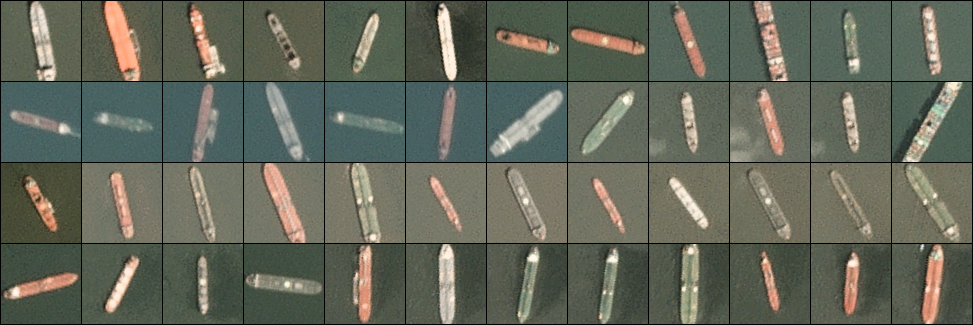
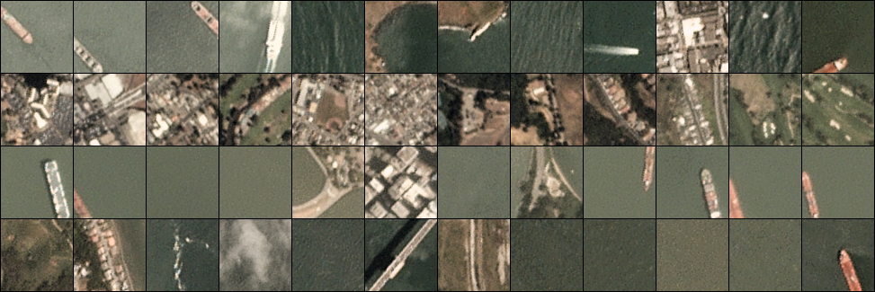

# 101-Ship-Detection

## Detecting Ships in Satellite Images 

- Satellite imagery are critical in many applications such as defense, agriculture, surveillance & intelligence. This project aims at detecting large vessels (ships) in sea from satellite images using Artificial Intelligence.

## Dataset Description

You can find the dataset on kaggle : https://www.kaggle.com/rhammell/ships-in-satellite-imagery

The dataset consists of image chips extracted from Planet satellite imagery collected over the San Francisco Bay and San Pedro Bay areas of California. It includes 4000 80x80 RGB images labeled with either a "ship" or "no-ship" classification. Image chips were derived from PlanetScope full-frame visual scene products, which are orthorectified to a 3 meter pixel size.

Provided is a zipped directory shipsnet.zip that contains the entire dataset as .png image chips. Each individual image filename follows a specific format: {label} __ {scene id} __ {longitude} _ {latitude}.png

label: Valued 1 or 0, representing the "ship" class and "no-ship" class, respectively.
scene id: The unique identifier of the PlanetScope visual scene the image chip was extracted from.

## Class Labels 

The "ship" class includes 1000 images. Images in this class are near-centered on the body of a single ship. Ships of different sizes, orientations, and atmospheric collection conditions are included. Example images from this class are shown below.

The "no-ship" class includes 3000 images. A third of these are a random sampling of different landcover features - water, vegetion, bare earth, buildings, etc. - that do not include any portion of an ship. The next third are "partial ships" that contain only a portion of an ship, but not enough to meet the full definition of the "ship" class. The last third are images that have previously been mislabeled by machine learning models, typically caused by bright pixels or strong linear features. Example images from this class are shown below.

## Acknowledgements

Satellite imagery used to build this dataset is made available through Planet's **Open California** dataset, which is **openly licensed**. As such, this dataset is also available under the same CC-BY-SA license. Users can sign up for a free Planet account to search, view, and download thier imagery and gain access to their API.
